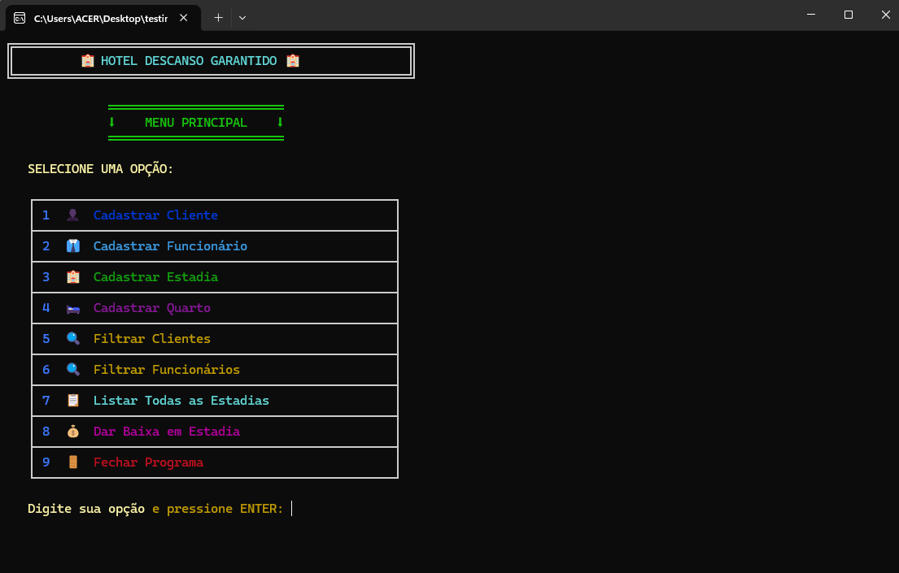
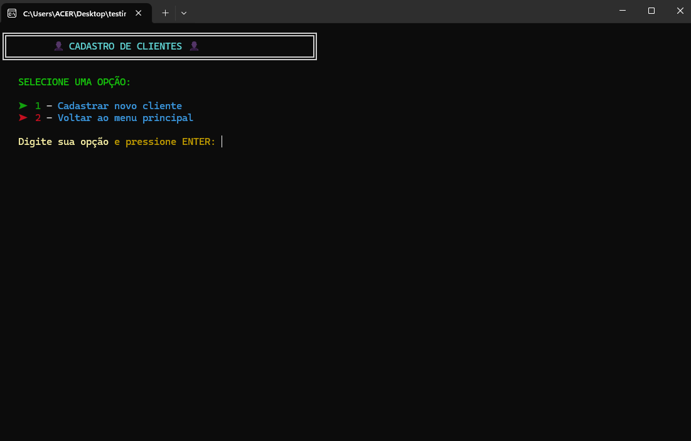
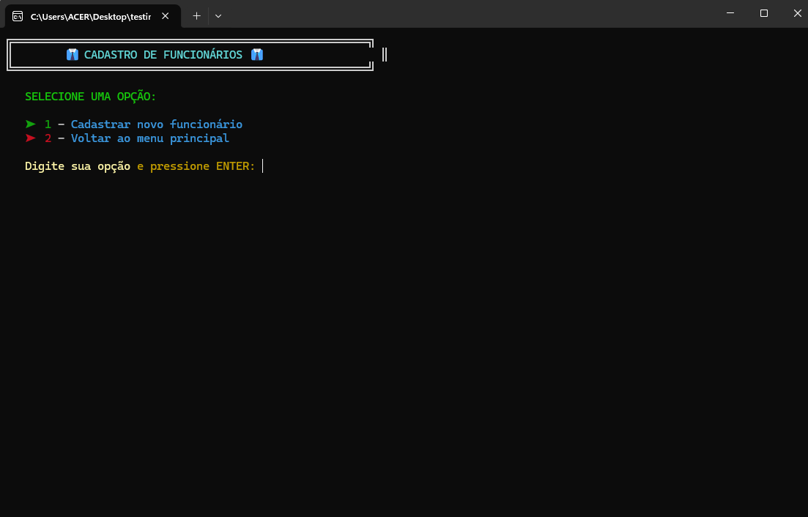
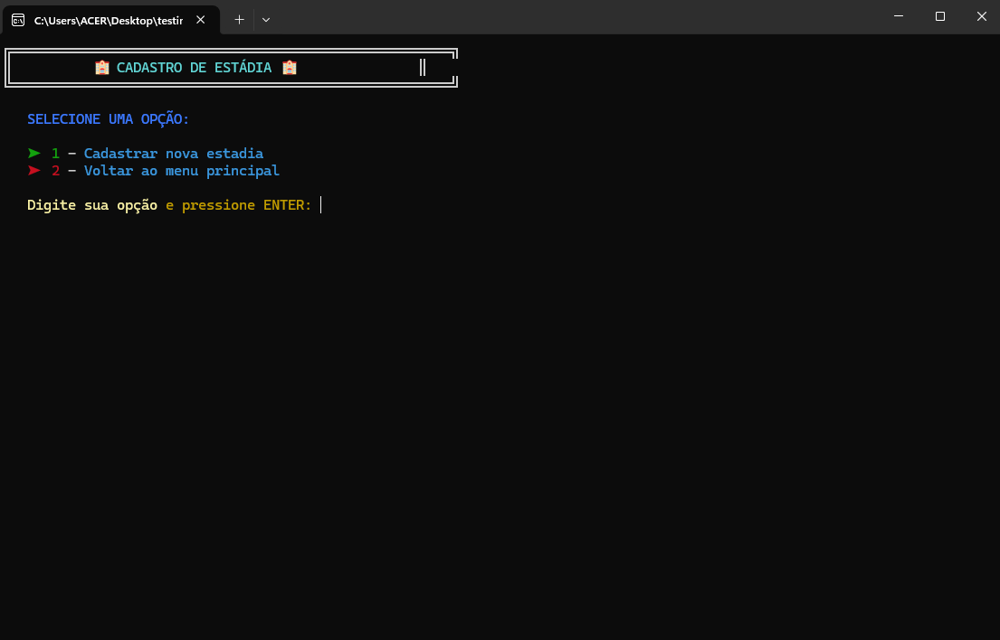

# Hotel Management System (C++ - Academic Project) 🏨

📚 Clone do Projeto desenvolvido na disciplina de Algoritmos e Estruturas de Dados I (AEDS I)  
Curso: Engenharia de Software  

O **Hotel Management System** é um sistema de gerenciamento de hotel desenvolvido em C++, com foco em Programação Orientada a Objetos, manipulação de arquivos binários e implementação manual de regras de negócio.

O sistema simula a gestão completa de um hotel, incluindo cadastro de clientes, controle de quartos, registros de estadias, cálculo de diárias e sistema de fidelidade.

---

## 🎯 Objetivo do Projeto

O projeto teve como objetivo aplicar na prática conceitos fundamentais de:

- Programação Orientada a Objetos (POO)
- Estruturas de dados utilizando vetores
- Persistência de dados com arquivos binários
- Validação de dados com expressões regulares
- Implementação de regras de negócio reais
- Organização modular de código

---

## 🚀 Funcionalidades Implementadas

### 👤 Gestão de Clientes
- Cadastro de clientes
- Validação de CPF e e-mail
- Sistema de pontos de fidelidade
- Histórico de hospedagens

### 🛏️ Gestão de Quartos
- Cadastro de quartos
- Controle de status (Livre / Ocupado)
- Associação de tipo e valor da diária

### 📅 Gestão de Estadias
- Registro de check-in
- Registro de check-out
- Verificação de conflito de datas
- Cálculo automático do valor da estadia
- Atualização automática do status do quarto

### 💾 Persistência de Dados
- Armazenamento em arquivos binários
- Salvamento e carregamento automático de dados
- Simulação de banco de dados sem uso de SGBD

---

## 🛠️ Tecnologias Utilizadas

- C++
- Programação Orientada a Objetos
- Biblioteca `<fstream>` para persistência
- Biblioteca `<regex>` para validação
- Estruturas de dados com vetores

---

## 📊 Estrutura do Sistema

O sistema foi modelado utilizando as seguintes classes principais:

- `Cliente`
- `Funcionario`
- `Quarto`
- `Estadia`

Cada classe possui responsabilidades bem definidas, respeitando os princípios básicos de organização e separação de responsabilidades.

---

## 🧠 Regras de Negócio Aplicadas

- Impedir reserva de quarto já ocupado
- Validar intervalos de datas
- Calcular número de diárias automaticamente
- Atualizar status do quarto em tempo real
- Registrar histórico completo por cliente
- Sistema de pontuação baseado em estadias

---

## 👨‍💻 Minha Contribuição

Neste projeto participei ativamente da:

- Modelagem das entidades do sistema
- Implementação de regras de negócio
- Desenvolvimento da lógica de persistência
- Validação de dados de entrada
- Testes funcionais do sistema

## Equipe de desenvolvimento

- Arthur Lima Mendes
- Eduardo Lopes Araujo Pegô
- Ítalo Eduardo Carneiro da Silva
- Vinicius Matos Oliveira Rocha

## 🧪 Testes e Validações

Foram realizados testes manuais para:

- Cadastro inválido de dados
- Conflito de datas de reservas
- Testes de persistência (salvar e reabrir o sistema)
- Cálculo correto de valores

---

## 💡 Aprendizados Técnicos

Este projeto foi fundamental para consolidar:

- Lógica de programação
- Modelagem orientada a objetos
- Estruturas e organização de código
- Pensamento sistêmico
- Tratamento de exceções e validações
- Simulação de regras reais de mercado

Foi um dos primeiros projetos estruturados desenvolvidos no curso e representa a base da evolução posterior para sistemas web e arquiteturas mais complexas.

---

## 📌 Observação

Este projeto foi desenvolvido exclusivamente para fins acadêmicos, com foco no aprendizado de fundamentos antes da utilização de frameworks e bancos de dados modernos.

---

## 🚀 Possível Evolução Futura

- Migrar para arquitetura Web
- Implementar banco de dados relacional
- Criar API REST
- Criar interface gráfica
- Aplicar padrões de projeto

---

## 👨‍💻 Autores

- Ítalo Eduardo Carneiro da Silva  
- Arthur Lima Mendes
- Eduardo Lopes Araujo Pêgo
- Vinicius Matos Oliveira Rocha
- Estudantes de Engenharia de Software

## Telas de demonstramento do sistema implementado

